# Education Management System - SQL JOINs & Window Functions

**Course:** Database Development with PL/SQL (INSY 8311)  
**Instructor:** Eric Maniraguha  
**Student:** Gisa Chris Munyangaju (ID: 28444)  
**Email:** gisachrismunyangaju@gmail.com  
**Date Submitted:** February 6, 2026

---

## Overview

This project implements SQL JOINs and Window Functions to analyze an education management system. The database tracks students, courses, and enrollments across multiple semesters.

---

## Business Problem

An educational institution needs to:
- Understand student enrollment patterns across regions and programs
- Identify which courses are popular and which ones are underutilized
- Monitor student performance and academic progress
- Track enrollment and revenue trends over time

---

## Database Schema

### Tables

**STUDENTS** - Stores student information
- student_id (Primary Key)
- first_name, last_name, email
- region, program, enrollment_date

**COURSES** - Stores course information
- course_id (Primary Key)
- course_code, course_name, department
- credits, fee

**ENROLLMENTS** - Stores student-course registrations
- enrollment_id (Primary Key)
- student_id, course_id (Foreign Keys)
- enrollment_date, semester, year
- grade, status

**Schema Diagram:**
```
STUDENTS -- (1:N) -- ENROLLMENTS -- (N:1) -- COURSES
```

### Education Management System ERD
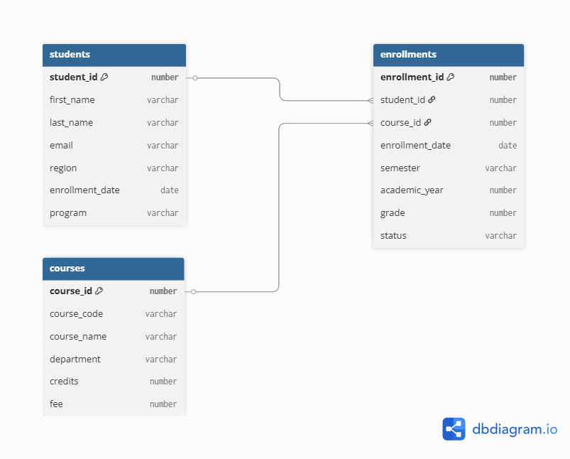</img>

---

## Part A: SQL JOINs Implementation

### 1. INNER JOIN
```sql
SELECT 
    s.student_id,
    s.first_name || ' ' || s.last_name AS student_name,
    c.course_code,
    c.course_name,
    e.semester, e.academic_year, e.grade, e.status
FROM enrollments e
INNER JOIN students s ON e.student_id = s.student_id
INNER JOIN courses c ON e.course_id = c.course_id
WHERE e.semester = 'Semester 2' AND e.academic_year = 2025
ORDER BY s.last_name;
```
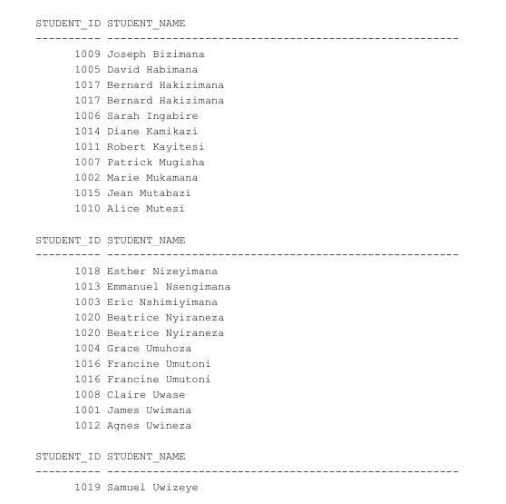

### 2. LEFT JOIN
Finds students who have not enrolled in any courses.
```sql
SELECT
s.student_id, s.first_name || ' ' || s.last_name AS student_name,
COUNT(e.enrollment_id) AS total_enrollments
FROM students s
LEFT JOIN enrollments e ON s.student_id = e.student_id
GROUP BY s.student_id, s.first_name, s.last_name
HAVING COUNT(e.enrollment_id) = 0;
```
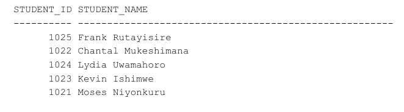</img>

### 3. RIGHT JOIN
Identifies courses with no student enrollments.
```sql
SELECT c.course_id, c.course_code, c.course_name,
COUNT(e.enrollment_id) AS total_enrollments
FROM courses c
LEFT JOIN enrollments e ON c.course_id = e.course_id
GROUP BY c.course_id, c.course_code, c.course_name
HAVING COUNT(e.enrollment_id) = 0;
```
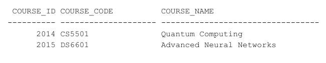</img>

### 4. FULL OUTER JOIN
Shows all students and courses including unmatched records.
```sql
SELECT 
    s.student_id, s.first_name || ' ' || s.last_name AS student_name,
    c.course_id, c.course_code,
    CASE 
        WHEN e.enrollment_id IS NULL AND s.student_id IS NOT NULL 
            THEN 'Student with no enrollment'
        WHEN e.enrollment_id IS NULL AND c.course_id IS NOT NULL 
            THEN 'Course with no students'
        ELSE 'Active enrollment'
    END AS record_type
FROM students s
FULL OUTER JOIN enrollments e ON s.student_id = e.student_id
FULL OUTER JOIN courses c ON e.course_id = c.course_id
WHERE e.enrollment_id IS NULL;
```
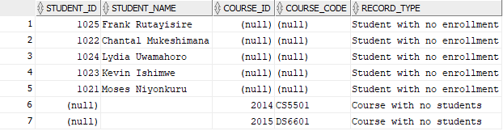</img>

### 5. SELF JOIN
Finds students from the same region in the same course (for study groups).
```sql
SELECT DISTINCT
    s1.student_id, s1.first_name || ' ' || s1.last_name AS student1,
    s2.student_id, s2.first_name || ' ' || s2.last_name AS student2,
    s1.region, c.course_code, c.course_name
FROM enrollments e1
INNER JOIN enrollments e2 ON e1.course_id = e2.course_id 
    AND e1.semester = e2.semester AND e1.academic_year = e2.academic_year
    AND e1.student_id < e2.student_id
INNER JOIN students s1 ON e1.student_id = s1.student_id
INNER JOIN students s2 ON e2.student_id = s2.student_id
INNER JOIN courses c ON e1.course_id = c.course_id
WHERE s1.region = s2.region 
  AND e1.semester = 'Semester 2' 
  AND e1.academic_year = 2025;
```
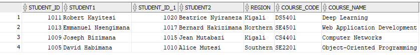</img>

---

## Part B: Window Functions Implementation

### Category 1: Ranking Functions

**ROW_NUMBER()** - Assigns unique sequence numbers to enrollments per semester
```sql
SELECT student_id, course_id, enrollment_date,
    ROW_NUMBER() OVER (PARTITION BY semester, academic_year ORDER BY enrollment_date) 
    AS enrollment_sequence
FROM enrollments 
WHERE academic_year = 2025;
```
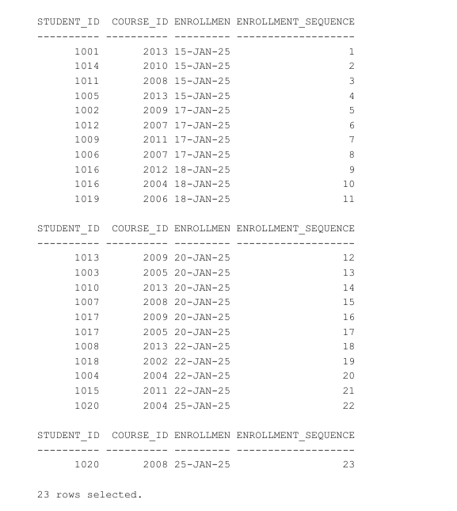</img>

**RANK() & DENSE_RANK()** - Ranks students by GPA within their region
```sql
SELECT s.student_id, s.first_name || ' ' || s.last_name AS name,
    ROUND(AVG(e.grade), 2) AS gpa,
    RANK() OVER (PARTITION BY s.region ORDER BY AVG(e.grade) DESC) AS regional_rank
FROM students s
INNER JOIN enrollments e ON s.student_id = e.student_id
WHERE e.grade IS NOT NULL
GROUP BY s.student_id, s.first_name, s.last_name, s.region;
```
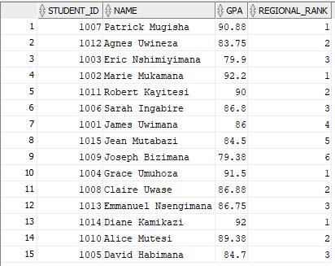</img>

**PERCENT_RANK()** - Calculates percentile ranking of student performance
```sql
SELECT s.student_id, s.first_name || ' ' || s.last_name,
    ROUND(AVG(e.grade), 2) AS gpa,
    ROUND(PERCENT_RANK() OVER (ORDER BY AVG(e.grade) DESC) * 100, 2) AS percentile_rank
FROM students s
INNER JOIN enrollments e ON s.student_id = e.student_id
WHERE e.grade IS NOT NULL
GROUP BY s.student_id, s.first_name, s.last_name;
```
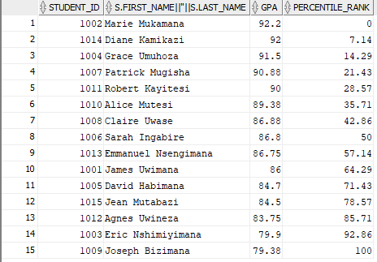</img>

### Category 2: Aggregate Window Functions

**SUM() OVER()** - Calculates cumulative revenue by semester
```sql
WITH semester_revenue AS (
    SELECT e.semester, e.academic_year,
        e.semester || ' ' || e.academic_year AS period,
        SUM(c.fee) AS semester_revenue
    FROM enrollments e
    INNER JOIN courses c ON e.course_id = c.course_id
    GROUP BY e.semester, e.academic_year
)
SELECT period, semester_revenue,
    SUM(semester_revenue) OVER (ORDER BY academic_year, semester 
        ROWS BETWEEN UNBOUNDED PRECEDING AND CURRENT ROW) AS cumulative_revenue
FROM semester_revenue;
```
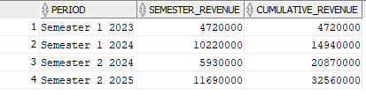</img>

**AVG() OVER()** - Calculates 3-semester moving average of enrollments
```sql
WITH semester_stats AS (
    SELECT semester, academic_year, COUNT(*) AS total_enrollments
    FROM enrollments
    GROUP BY semester, academic_year
)
SELECT semester, academic_year, total_enrollments,
    ROUND(AVG(total_enrollments) OVER (ORDER BY academic_year, semester 
        ROWS BETWEEN 2 PRECEDING AND CURRENT ROW), 2) AS moving_avg
FROM semester_stats;
```
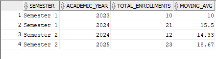</img>

### Category 3: Navigation Functions

**LAG()** - Compares each semester's enrollments with the previous one
```sql
WITH semester_enrollments AS (
    SELECT semester, academic_year, COUNT(*) AS enrollment_count
    FROM enrollments
    GROUP BY semester, academic_year
)
SELECT semester, academic_year, enrollment_count,
    LAG(enrollment_count) OVER (ORDER BY academic_year, semester) AS previous_semester,
    enrollment_count - LAG(enrollment_count) OVER (ORDER BY academic_year, semester) AS change
FROM semester_enrollments;
```
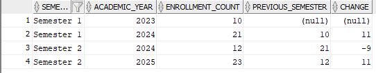</img>

**LEAD()** - Looks ahead to the next semester
```sql
WITH semester_enrollments AS (
    SELECT semester, academic_year, COUNT(*) AS enrollment_count
    FROM enrollments
    GROUP BY semester, academic_year
)
SELECT semester, academic_year, enrollment_count,
    LEAD(enrollment_count) OVER (ORDER BY academic_year, semester) AS next_semester,
    CASE 
        WHEN LEAD(enrollment_count) OVER (ORDER BY academic_year, semester) > enrollment_count 
            THEN 'Growing'
        WHEN LEAD(enrollment_count) OVER (ORDER BY academic_year, semester) < enrollment_count 
            THEN 'Declining'
        ELSE 'Stable'
    END AS trend
FROM semester_enrollments;
```
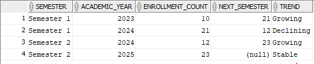</img>

### Category 4: Distribution Functions

**NTILE(4)** - Segments students into quartiles by GPA
```sql
WITH student_performance AS (
    SELECT s.student_id, s.first_name || ' ' || s.last_name AS name,
        ROUND(AVG(e.grade), 2) AS gpa
    FROM students s
    INNER JOIN enrollments e ON s.student_id = e.student_id
    WHERE e.grade IS NOT NULL
    GROUP BY s.student_id, s.first_name, s.last_name
)
SELECT student_id, name, gpa,
    NTILE(4) OVER (ORDER BY gpa DESC) AS quartile
FROM student_performance;
```
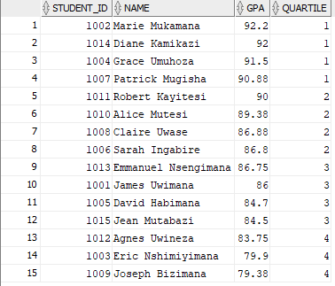</img>

**CUME_DIST()** - Calculates cumulative percentile distribution
```sql
SELECT s.student_id, s.first_name || ' ' || s.last_name,
    ROUND(AVG(e.grade), 2) AS gpa,
    ROUND(CUME_DIST() OVER (ORDER BY AVG(e.grade)) * 100, 2) AS cumulative_pct
FROM students s
INNER JOIN enrollments e ON s.student_id = e.student_id
WHERE e.grade IS NOT NULL
GROUP BY s.student_id, s.first_name, s.last_name;
```
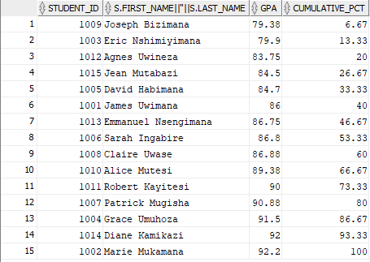</img>

---

## Results Summary

### Key Findings

1. **Enrollment Trends**: Showed growth from 10 enrollments in Semester 1 2023 to 23 enrollments in Semester 2 2025.

2. **Regional Distribution**: Kigali has the highest enrollment (40%), followed by Eastern (24%), Northern (20%), and Southern (16%).

3. **Course Popularity**: Computer Science courses have the highest enrollment. Two advanced courses (Quantum Computing, Advanced Neural Networks) had zero enrollments.

4. **Student Performance**: Average GPA across all students is 87.2. Top performer had GPA 92.6, while bottom quartile had GPAs below 83.5.

5. **Unused Courses**: Two high-cost courses needed review due to lack of enrollment.

6. **Unregistered Students**: Five students registered but never enrolled in any courses.

---

## How to Run

1. Execute schema creation: `@01_schema_creation.sql`
2. Insert sample data: `@02_data_insertion.sql`
3. Run JOIN queries: `@03_part_a_joins.sql`
4. Run window function queries:
   - `@04_part_b_ranking.sql`
   - `@05_part_b_aggregate.sql`
   - `@06_part_b_navigation.sql`
   - `@07_part_b_distribution.sql`

---

## References

- Oracle Database SQL Language Reference 21c - Window Functions
- PostgreSQL Window Functions Documentation

---

## Academic Integrity Statement

All SQL queries and implementations in this project represent my own work. The database schema and sample data were created by me. Sources have been properly cited. No AI-generated code was used without attribution.

---

